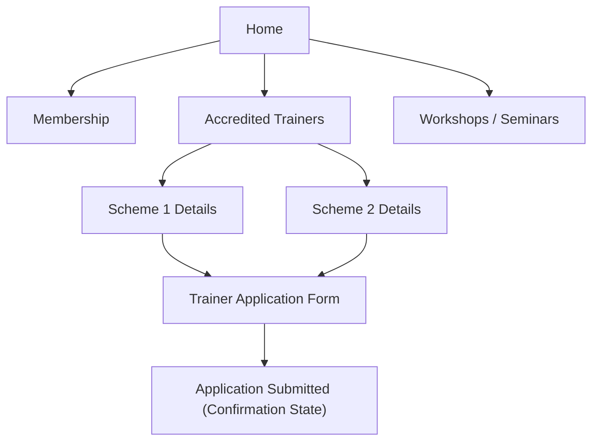

## 1. Product Overview
Add an Accredited Trainers page (two schemes with application forms), update Membership to show two pathways, and update Workshops/Seminars schedule to 2026 virtual sessions (9am–12pm).
This improves clarity for prospective trainers/members and ensures visitors see the current year’s schedule.

## 2. Core Features

### 2.1 User Roles
| Role | Registration Method | Core Permissions |
|------|---------------------|------------------|
| Public Visitor | None | Can view pages and submit trainer application forms |
| Site Admin (internal) | Existing process (out of scope) | Receives/handles submitted applications (out of scope) |

### 2.2 Feature Module
1. **Home**: primary navigation to Membership, Accredited Trainers, Workshops/Seminars.
2. **Accredited Trainers**: two scheme overviews, scheme comparison, application forms.
3. **Membership**: two membership pathways, pathway details, CTA links.
4. **Workshops/Seminars**: updated 2026 schedule, virtual session info (9am–12pm).

### 2.3 Page Details
| Page Name | Module Name | Feature description |
|-----------|-------------|---------------------|
| Home | Primary navigation | Link to Membership, Accredited Trainers, and Workshops/Seminars pages. |
| Accredited Trainers | Scheme overview | Present the two trainer accreditation schemes with eligibility summary and key differences. |
| Accredited Trainers | Scheme comparison | Compare the two schemes in a compact table (focus: who it’s for, requirements, outcomes). |
| Accredited Trainers | Application form | Allow visitors to select a scheme and submit an application (contact + background info + required uploads if applicable) and show an in-page submission confirmation state. |
| Membership | Pathway overview | Present two membership pathways with clear “Who it’s for” summaries. |
| Membership | Pathway details | Explain each pathway’s key benefits/requirements and provide a clear CTA (e.g., “Enquire / Apply”). |
| Workshops/Seminars | 2026 schedule | Display all workshops/seminars as virtual events for 2026, each shown as 9am–12pm. |
| Workshops/Seminars | Event details snippet | Show per-event title, date, format (Virtual), time (9am–12pm), and a registration/enquiry CTA (link destination can remain existing). |

## 3. Core Process
- Visitor Flow (Accredited Trainers): Navigate to Accredited Trainers → review the two schemes → choose a scheme → complete and submit the application form → see confirmation message (and instructions for next steps).
- Visitor Flow (Membership): Navigate to Membership → compare the two membership pathways → choose a pathway → click the relevant CTA to proceed (destination remains the existing process).
- Visitor Flow (Workshops/Seminars): Navigate to Workshops/Seminars → view the 2026 virtual schedule → pick an event → follow the registration/enquiry CTA.

