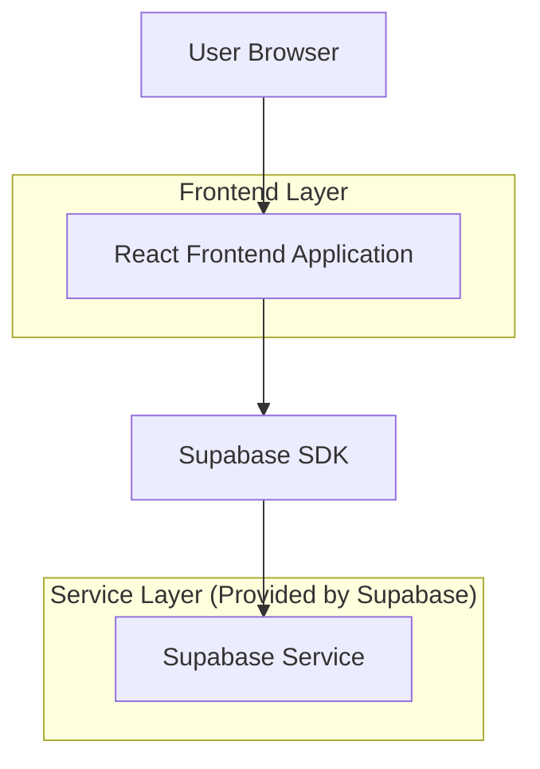
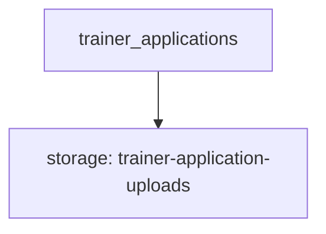

## 1.Architecture design


## 2.Technology Description
- Frontend: React@18 + react-router-dom@6 + tailwindcss@3 + vite
- Backend: Supabase (Auth optional; DB + Storage for trainer applications)

## 3.Route definitions
| Route | Purpose |
|-------|---------|
| / | Home page navigation to key pages |
| /accredited-trainers | Two schemes overview + scheme comparison + application form |
| /membership | Display two membership pathways and CTAs |
| /workshops-seminars | Display 2026 virtual schedule (9am–12pm) |

## 6.Data model(if applicable)

### 6.1 Data model definition


Proposed entities (minimal):
- trainer_applications
  - id (uuid)
  - scheme (text)
  - full_name (text)
  - email (text)
  - phone (text, optional)
  - experience_summary (text, optional)
  - attachments (jsonb: storage object paths, optional)
  - created_at (timestamptz)

### 6.2 Data Definition Language
Trainer applications (trainer_applications)
```
-- create table
CREATE TABLE trainer_applications (
  id UUID PRIMARY KEY DEFAULT gen_random_uuid(),
  scheme TEXT NOT NULL,
  full_name TEXT NOT NULL,
  email TEXT NOT NULL,
  phone TEXT,
  experience_summary TEXT,
  attachments JSONB,
  created_at TIMESTAMPTZ NOT NULL DEFAULT NOW()
);

-- recommended indexes
CREATE INDEX idx_trainer_applications_created_at ON trainer_applications(created_at DESC);
CREATE INDEX idx_trainer_applications_scheme ON trainer_applications(scheme);

-- permissions (typical Supabase)
GRANT SELECT ON trainer_applications TO anon;
GRANT ALL PRIVILEGES ON trainer_applications TO authenticated;
```

Notes (implementation-level):
- If you want the public to submit applications without accounts, use RLS policies to allow INSERT for anon and restrict SELECT to authenticated/admin workflows.
- Store uploads in a Supabase Storage bucket (e.g., trainer-application-uploads) and save resulting object paths in attachments.